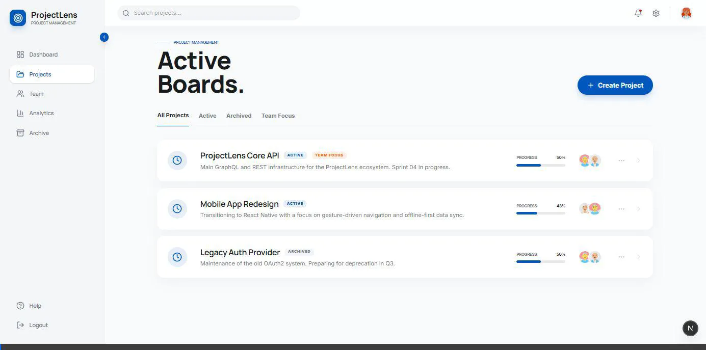

# ProjectLens: Frontend Agile Edition 🚀
### Impulsado por Next.js 14 & Estética Premium (Design by Stitch)

Bienvenido a la interfaz de **ProjectLens**, una solución de gestión de proyectos diseñada para ofrecer una experiencia de usuario fluida, rápida y visualmente impactante, inspirada en los estándares de **Stitch**.

---

## 🏗️ Arquitectura y Tecnologías

### ¿Por qué Next.js 14?
Hemos seleccionado Next.js como núcleo del frontend por sus capacidades de vanguardia en rendimiento y escalabilidad:

*   **Server Components (SSR) vs Client Components (CSR)**: 
    *   Utilizamos **React Server Components (RSC)** para la captura inicial de datos y la estructura de las páginas, lo que reduce drásticamente el bundle enviado al cliente y optimiza el SEO.
    *   Implementamos **Client Components** estratégicamente en áreas de alta interactividad, como el tablero de tareas (Backlog), los filtros de estado y los formularios de creación, donde el estado del navegador y los manejadores de eventos son esenciales.
*   **App Router**: Aprovechamos el sistema de rutas basado en archivos para una navegación instantánea y layouts persistentes (como el Sidebar y TopNavbar).

### Manejo de Estado con Zustand
Para este challenge, optamos por **Zustand** sobre Context API/Redux por su simplicidad y eficiencia:
*   **Cero Boilerplate**: Menos código para configurar el almacenamiento global.
*   **Suscripciones Selectivas**: Los componentes solo se re-renderizan si la porción específica del estado que consumen cambia, garantizando un rendimiento óptimo incluso con listas extensas de tareas.

---

## ✨ Funcionalidades Core (Challenge Specs)

Nuestra implementación cubre y supera todos los requisitos del examen técnico:

1.  **Listado de Proyectos**: Vista tipo "Editorial List" con espaciado optimizado y filtrado dinámico por pestañas (*Active, Archived, Team Focus*).
2.  **Detalle de Proyecto**: Navegación dinámica (`/projects/[id]`) que carga de forma atómica el backlog y las métricas de salud.
3.  **Gestión de Tareas**: 
    *   Visualización clara de "Open Issues" vs "Recently Resolved".
    *   Creación de tareas *inline* (presionando `Enter`) para un flujo de trabajo sin interrupciones.
    *   Toggle de completado instantáneo con persistencia en backend.
4.  **Métricas de Progreso**: Barra de salud dinámicas y estadísticas de velocidad integradas en la cabecera.
5.  **Manejo de Estados**: Implementación de indicadores de carga (Skeletons/Loaders) y manejo de errores 404/500 con retroalimentación visual.

---

## 🎨 Diseño y Estética (Stitch Design System)

La aplicación sigue un lenguaje de diseño **Premium** basado en el ecosistema **Stitch**:

*   **Tipografía**: Uso exclusivo de **Manrope** (Headline/Body) para una legibilidad moderna y profesional.
*   **Paleta de Colores**:
    *   `Primary`: Blue (#0055D2) - Acciones principales y progreso.
    *   `Surface`: Soft Grays (#F8F9FA) - Fondos limpios para reducir la fatiga visual.
    *   `Accent`: SpringGreen / Amber - Indicadores de estado suaves.
*   **Elevación**: Uso de sombras ambientales (`shadow-ambient`) y elevaciones dinámicas al interactuar con las tarjetas.

### Echa un vistazo al workflow:

---

## 🛠️ Requisitos Técnicos & Buenas Prácticas

*   **React Hooks**: Uso intensivo de `useState`, `useEffect` y hooks personalizados de Zustand para lógica desacoplada.
*   **Separación de Componentes**: Estructura modular en `src/components`, manteniendo componentes pequeños, reutilizables y con una única responsabilidad.
*   **Optimización de Renders**: Uso de memoización implícita en Zustand y estructuras de datos planas para evitar re-procesamientos innecesarios en el DOM.

---

## 🚀 Guía de Inicio Rápido

1. Instala las dependencias: `npm install`
2. Inicia el servidor de desarrollo: `npm run dev`

---
*Desarrollado con ❤️ para el proceso de Ubicalo.*
